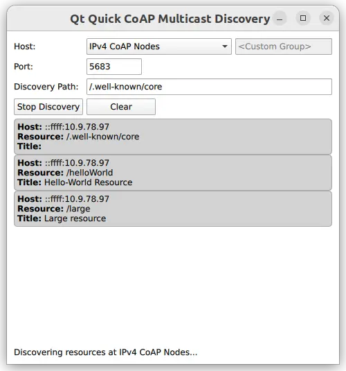

[Qt CoAP Examples](qtcoap-examples.md)> Quick CoAP Multicast Discovery
**Contents**

- [Running the Example](#running-the-example)
- [Setting Up a CoAP Server](#setting-up-a-coap-server)
- [Using the Docker-based Test Server](#using-the-docker-based-test-server)
- [Exposign C++ Classes to QML](#exposign-c-classes-to-qml)
- [Adjusting Build Files](#adjusting-build-files)
- [CMake Build](#cmake-build)
- [qmake Build](#qmake-build)
- [Using New QML Types](#using-new-qml-types)

# Quick CoAP Multicast Discovery

Using the CoAP client for a multicast resource discovery with a Qt Quick user interface.


The _Quick CoAP Multicast Discovery_ example demonstrates how to register [QCoapClient](qcoapclient.md) as a QML type and use it in a Qt Quick application for CoAP multicast resource discovery.
> **Note:** Qt CoAP does not provide a QML API in its current version. However, you can make the C++ classes of the module available to QML as shown in this example.

#### Running the Example

To run the example from [Qt Creator](https://doc.qt.io/qtcreator/), open the **Welcome** mode and select the example from **Examples**. For more information, see [Qt Creator: Tutorial: Build and run](https://doc.qt.io/qtcreator/creator-build-example-application.html).

#### Setting Up a CoAP Server

To run the example application, you first need to set up and start at least one CoAP server supporting multicast resource discovery. You have the following options:
- Manually build and run CoAP servers using [libcoap](https://github.com/obgm/libcoap), [Californium](https://github.com/eclipse/californium/), or any other CoAP server implementation, which supports multicast and resource discovery features.
- Use the ready Docker image available at Docker Hub, which builds and starts CoAP server based on Californium's [multicast server example](https://github.com/eclipse/californium/tree/2.0.0/demo-apps/cf-helloworld-server).


##### Using the Docker-based Test Server

The following command pulls the docker container for the CoAP server from the Docker Hub and starts it:
```cpp
docker run --name coap-multicast-server -d --rm --net=host tqtc/coap-multicast-test-server:californium-2.0.0

```

> **Note:** You can run more than one multicast CoAP servers (on the same host or other hosts in the network) by passing a different --name to the command above.

To terminate the docker container after usage, first obtain the container's ID by executing the `docker ps` command. The output will look like this:
```cpp
$ docker ps
CONTAINER ID   IMAGE
8b991fae7789   tqtc/coap-multicast-test-server:californium-2.0.0

```

After that, use this ID to stop the container:
```cpp
docker stop <container_id>

```


#### Exposign C++ Classes to QML

In this example, you need to expose the [QCoapResource](qcoapresource.md) and [QCoapClient](qcoapclient.md) classes, as well as the [QtCoap](qtcoap.md) namespace, to QML. To achieve this, create custom wrapper classes and use the special [registration macros](https://doc.qt.io/qt-6/qtqml-cppintegration-definetypes.html).
Create the `QmlCoapResource` class as a wrapper around [QCoapResource](qcoapresource.md). Use the [Q_PROPERTY](https://doc.qt.io/qt-6/qobject.html#Q_PROPERTY) macro to make several properties accessible from QML. The class does not need to be directly instantiable from QML, so use the [QML_ANONYMOUS](https://doc.qt.io/qt-6/qqmlengine.html#QML_ANONYMOUS) macro to register it.
```cpp
class QmlCoapResource : public QCoapResource
{
    Q_GADGET
    Q_PROPERTY(QString title READ title)
    Q_PROPERTY(QString host READ hostStr)
    Q_PROPERTY(QString path READ path)

    QML_ANONYMOUS
public:
    QmlCoapResource() : QCoapResource() {}
    QmlCoapResource(const QCoapResource &resource)
        : QCoapResource(resource) {}

    QString hostStr() const { return host().toString(); }
};

```

After that, create the `QmlCoapMulticastClient` class with the [QCoapClient](qcoapclient.md) class as a base class. Use the [Q_PROPERTY](https://doc.qt.io/qt-6/qobject.html#Q_PROPERTY) macro to expose a custom property, and also create several [Q_INVOKABLE](https://doc.qt.io/qt-6/qobject.html#Q_INVOKABLE) methods. Both the property and the invokable methods can be accessed from QML. Unlike `QmlCoapResource`, you want to be able to create this class from QML, so use the [QML_NAMED_ELEMENT](https://doc.qt.io/qt-6/qqmlengine.html#QML_NAMED_ELEMENT) macro to register the class in QML.
```cpp
class QmlCoapMulticastClient : public QCoapClient
{
    Q_OBJECT

    Q_PROPERTY(bool isDiscovering READ isDiscovering NOTIFY isDiscoveringChanged)

    QML_NAMED_ELEMENT(CoapMulticastClient)
public:
    QmlCoapMulticastClient(QObject *parent = nullptr);

    Q_INVOKABLE void discover(const QString &host, int port, const QString &discoveryPath);
    Q_INVOKABLE void discover(QtCoap::MulticastGroup group, int port, const QString &discoveryPath);
    Q_INVOKABLE void stopDiscovery();

    bool isDiscovering() const;

Q_SIGNALS:
    void discovered(const QmlCoapResource &resource);
    void finished(int error);
    // The bool parameter is not provided, because the signal is only used by
    // the QML property system, and it does not use the passed value anyway.
    void isDiscoveringChanged();

public slots:
    void onDiscovered(QCoapResourceDiscoveryReply *reply, const QList<QCoapResource> &resources);

private:
    QCoapResourceDiscoveryReply *m_reply = nullptr;
};

```

Finally, register the [QtCoap](qtcoap.md) namespace, so that you can use the enums provided there:
```cpp
namespace QCoapForeignNamespace
{
    Q_NAMESPACE
    QML_FOREIGN_NAMESPACE(QtCoap)
    QML_NAMED_ELEMENT(QtCoap)
}

```


#### Adjusting Build Files

To make the custom types available from QML, update the build system files accordingly.

##### CMake Build

For a [CMake](qtcoap-quicksecureclient-example.md)-based build, add the following to the `CMakeLists.txt`:
```cpp
qt_add_qml_module(quickmulticastclient
    URI CoapClientModule
    VERSION 1.0
    SOURCES
        qmlcoapmulticastclient.cpp qmlcoapmulticastclient.h
    QML_FILES
        Main.qml
)


```


##### qmake Build

For a qmake build, modify the `quickmulticastclient.pro` file in the following way:
```cpp
CONFIG += qmltypes
QML_IMPORT_NAME = CoapClientModule
QML_IMPORT_MAJOR_VERSION = 1
    ...
qml_resources.files = \
    qmldir \
    Main.qml

qml_resources.prefix = /qt/qml/CoapClientModule

RESOURCES += qml_resources


```


#### Using New QML Types

Now, when the C++ classes are properly exposed to QML, you can use the new types:
```qml
CoapMulticastClient {
    id: client
    onDiscovered: (resource) => { root.addResource(resource) }

    onFinished: (error) => {
        statusLabel.text = (error === QtCoap.Error.Ok)
                ? qsTr("Finished resource discovery.")
                : qsTr("Resource discovery failed with error code: %1").arg(error)
    }
}

```

The `QmlCoapMulticastClient::finished()` signal triggers the `onFinished` signal handler, to show the request's status in the UI. Note that the example does not use [QCoapClient](qcoapclient.md)'s signals directly, because both [error()](qcoapclient.md#error) and [finished()](qcoapclient.md#finished) signals take a [QCoapReply](qcoapreply.md) as a parameter (which is not exposed to QML), and the example only requires the error code.
The `QmlCoapMulticastClient`'s constructor forwards the [QCoapClient](qcoapclient.md)'s signals to `QmlCoapMulticastClient::finished()` signal:
```cpp
QmlCoapMulticastClient::QmlCoapMulticastClient(QObject *parent)
    : QCoapClient(QtCoap::SecurityMode::NoSecurity, parent)
{
    connect(this, &QCoapClient::finished, this,
            [this](QCoapReply *reply) {
                if (reply) {
                    emit finished(static_cast<int>(reply->errorReceived()));
                    reply->deleteLater();
                    if (m_reply == reply) {
                        m_reply = nullptr;
                        emit isDiscoveringChanged();
                    }
                } else {
                    qCWarning(lcCoapClient, "Something went wrong, received a null reply");
                }
            });

    connect(this, &QCoapClient::error, this,
            [this](QCoapReply *, QtCoap::Error err) {
                emit finished(static_cast<int>(err));
            });
}

```

When the **Discover** button is pressed, one of the overloaded `discover()` methods is invoked, based on the selected multicast group:
```qml
Button {
    id: discoverButton
    text: client.isDiscovering ? qsTr("Stop Discovery") : qsTr("Discover")
    Layout.preferredWidth: 100

    onClicked: {
        if (client.isDiscovering) {
            client.stopDiscovery()
        } else {
            var currentGroup = groupComboBox.model.get(groupComboBox.currentIndex).value;

            var path = "";
            if (currentGroup !== - 1) {
                client.discover(currentGroup, parseInt(portField.text),
                                discoveryPathField.text);
                path = groupComboBox.currentText;
            } else {
                client.discover(customGroupField.text, parseInt(portField.text),
                                discoveryPathField.text);
                path = customGroupField.text + discoveryPathField.text;
            }
            statusLabel.text = qsTr("Discovering resources at %1...").arg(path);
        }
    }
}

```

This overload is called when a custom multicast group or a host address is selected:
```cpp
void QmlCoapMulticastClient::discover(const QString &host, int port, const QString &discoveryPath)
{
    QUrl url;
    url.setHost(host);
    url.setPort(port);

    m_reply = QCoapClient::discover(url, discoveryPath);
    if (m_reply) {
        connect(m_reply, &QCoapResourceDiscoveryReply::discovered,
                this, &QmlCoapMulticastClient::onDiscovered);
        emit isDiscoveringChanged();
    } else {
        qCWarning(lcCoapClient, "Discovery request failed.");
    }
}

```

And this overload is called when one of the suggested multicast groups is selected in the UI:
```cpp
void QmlCoapMulticastClient::discover(QtCoap::MulticastGroup group, int port,
                                      const QString &discoveryPath)
{
    m_reply = QCoapClient::discover(group, port, discoveryPath);
    if (m_reply) {
        connect(m_reply, &QCoapResourceDiscoveryReply::discovered,
                this, &QmlCoapMulticastClient::onDiscovered);
        emit isDiscoveringChanged();
    } else {
        qCWarning(lcCoapClient, "Discovery request failed.");
    }
}

```

The [QCoapResourceDiscoveryReply::discovered()](qcoapresourcediscoveryreply.md#discovered) signal delivers a list of [QCoapResource](qcoapresource.md)s, which is not a QML type. To make the resources available in QML, forward each resource in the list to the `QmlCoapMulticastClient::discovered()` signal, which takes a `QmlCoapResource` instead:
```cpp
void QmlCoapMulticastClient::onDiscovered(QCoapResourceDiscoveryReply *reply,
                                          const QList<QCoapResource> &resources)
{
    Q_UNUSED(reply)
    for (const auto &resource : resources)
        emit discovered(resource);
}

```

The discovered resources are added to the `resourceModel` of the list view in the UI:
```qml
function addResource(resource) {
    resourceModel.insert(0, {"host" : resource.host,
                             "path" : resource.path,
                             "title" : resource.title})
}

```

While the discovery is in progress, press the **Stop Discovery** button to stop the discovery. Internally it is done by aborting the current request:
```cpp
void QmlCoapMulticastClient::stopDiscovery()
{
    if (m_reply)
        m_reply->abortRequest();
}

```


---

*Built with QDoc's template engine.*
