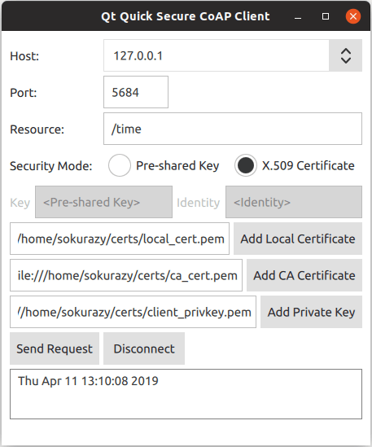

[Qt CoAP Examples](qtcoap-examples.md)> Quick Secure CoAP Client
**Contents**

- [Running the Example](#running-the-example)
- [Exposing C++ Classes to QML](#exposing-c-classes-to-qml)
- [Adjusting Build Files](#adjusting-build-files)
- [CMake](#cmake)
- [qmake](#qmake)
- [Using New QML Types](#using-new-qml-types)
- [Creating the Client](#creating-the-client)
- [Sending a Request](#sending-a-request)
- [Setting Up a Secure CoAP Server](#setting-up-a-secure-coap-server)
- [Setting Up a Server For PSK Mode](#setting-up-a-server-for-psk-mode)
- [Setting Up a Server For Certificate Mode](#setting-up-a-server-for-certificate-mode)
- [Getting The IP Address](#getting-the-ip-address)
- [Terminating a Docker Container](#terminating-a-docker-container)

# Quick Secure CoAP Client

Securing the CoAP client and using it with a Qt Quick user interface.


_Quick Secure CoAP Client_ demonstrates how to create a secure CoAP client and use it in a Qt Quick application.
> **Note:** Qt CoAP does not provide a QML API in its current version. However, you can make the C++ classes of the module available to QML as it is shown in the example.

#### Running the Example

To run the example from [Qt Creator](https://doc.qt.io/qtcreator/), open the **Welcome** mode and select the example from **Examples**. For more information, see [Qt Creator: Tutorial: Build and run](https://doc.qt.io/qtcreator/creator-build-example-application.html).
To run the example application, you first need to set up a secure CoAP server. You can run the example with any secure CoAP server supporting one of the _pre-shared key (PSK)_ or _certificate_ authentication modes. For more information about setting up a secure CoAP server, see [Setting Up a Secure CoAP Server](qtcoap-quicksecureclient-example.md).

#### Exposing C++ Classes to QML

In this example, you need to expose the [QCoapClient](qcoapclient.md) class and the [QtCoap](qtcoap.md) namespace to QML. To achieve this, create a custom wrapper class and use the special [registration macros](https://doc.qt.io/qt-6/qtqml-cppintegration-definetypes.html).
Create the `QmlCoapSecureClient` class as a wrapper around [QCoapClient](qcoapclient.md). This class also holds the selected security mode and security configuration parameters. Use the [Q_INVOKABLE](https://doc.qt.io/qt-6/qobject.html#Q_INVOKABLE) macro to expose several methods to QML. Also use the [QML_NAMED_ELEMENT](https://doc.qt.io/qt-6/qqmlengine.html#QML_NAMED_ELEMENT) macro to register the class in QML as `CoapSecureClient`.
```cpp
class QmlCoapSecureClient : public QObject
{
    Q_OBJECT
    QML_NAMED_ELEMENT(CoapSecureClient)

public:
    QmlCoapSecureClient(QObject *parent = nullptr);
    ~QmlCoapSecureClient() override;

    Q_INVOKABLE void setSecurityMode(QtCoap::SecurityMode mode);
    Q_INVOKABLE void sendGetRequest(const QString &host, const QString &path, int port);
    Q_INVOKABLE void setSecurityConfiguration(const QString &preSharedKey, const QString &identity);
    Q_INVOKABLE void setSecurityConfiguration(const QString &localCertificatePath,
                                              const QString &caCertificatePath,
                                              const QString &privateKeyPath);
    Q_INVOKABLE void disconnect();

Q_SIGNALS:
    void finished(const QString &result);

private:
    QCoapClient *m_coapClient;
    QCoapSecurityConfiguration m_configuration;
    QtCoap::SecurityMode m_securityMode;
};

```

After that, register the [QtCoap](qtcoap.md) namespace, so that you can use the enums provided there:
```cpp
namespace QCoapForeignNamespace
{
    Q_NAMESPACE
    QML_FOREIGN_NAMESPACE(QtCoap)
    QML_NAMED_ELEMENT(QtCoap)
}

```


#### Adjusting Build Files

To make the custom types available from QML, update the build system files accordingly.

##### CMake

For a [CMake](qtcoap-quicksecureclient-example.md)-based build, add the following to the `CMakeLists.txt`:
```cpp
qt_add_qml_module(quicksecureclient
    URI CoapSecureClientModule
    SOURCES
        qmlcoapsecureclient.cpp qmlcoapsecureclient.h
    QML_FILES
        FilePicker.qml
        Main.qml
)


```


##### qmake

For a qmake build, modify the `quicksecureclient.pro` file in the following way:
```cpp
CONFIG += qmltypes
QML_IMPORT_NAME = CoapSecureClientModule
QML_IMPORT_MAJOR_VERSION = 1
    ...
qml_resources.files = \
    qmldir \
    FilePicker.qml \
    Main.qml

qml_resources.prefix = /qt/qml/CoapSecureClientModule

RESOURCES += qml_resources


```


#### Using New QML Types

Now, when the C++ classes are properly exposed to QML, you can use the new types.

##### Creating the Client

`CoapSecureClient` is instantiated from the `Main.qml` file. It handles the `QmlCoapSecureClient::finished()` signal and updates the UI accordingly:
```qml
CoapSecureClient {
    id: client
    onFinished: (result) => {
        outputView.text = result;
        statusLabel.text = "";
        disconnectButton.enabled = true;
    }
}

```

The instance of [QCoapClient](qcoapclient.md) is created when the user selects or changes the security mode in the UI. The `QmlCoapSecureClient::setSecurityMode()` method is invoked from the QML code, when one of the security modes is selected:
```qml
ButtonGroup {
    id: securityModeGroup
    onClicked: {
        if ((securityModeGroup.checkedButton as RadioButton) === preSharedMode)
            client.setSecurityMode(QtCoap.SecurityMode.PreSharedKey);
        else
            client.setSecurityMode(QtCoap.SecurityMode.Certificate);
    }
}

```

On the C++ side, this method creates a [QCoapClient](qcoapclient.md) and connects to its [finished()](qcoapclient.md#finished) and [error()](qcoapclient.md#error) signals. The class handles both signals internally, and forwards them to the new `finished()` signal.
```cpp
void QmlCoapSecureClient::setSecurityMode(QtCoap::SecurityMode mode)
{
    // Create a new client, if the security mode has changed
    if (m_coapClient && mode != m_securityMode) {
        delete m_coapClient;
        m_coapClient = nullptr;
    }

    if (!m_coapClient) {
        m_coapClient = new QCoapClient(mode);
        m_securityMode = mode;

        connect(m_coapClient, &QCoapClient::finished, this,
                [this](QCoapReply *reply) {
                    if (!reply)
                        emit finished(tr("Something went wrong, received a null reply"));
                    else if (reply->errorReceived() != QtCoap::Error::Ok)
                        emit finished(errorMessage(reply->errorReceived()));
                    else
                        emit finished(reply->message().payload());
                });

        connect(m_coapClient, &QCoapClient::error, this,
                [this](QCoapReply *, QtCoap::Error errorCode) {
                    emit finished(errorMessage(errorCode));
                });
    }
}

```


##### Sending a Request

Click the **Send Request** button to set the security configuration based on the selected security mode and send a `GET` request:
```qml
Button {
    id: requestButton
    text: qsTr("Send Request")
    enabled: securityModeGroup.checkState !== Qt.Unchecked

    onClicked: {
        outputView.text = "";
        if ((securityModeGroup.checkedButton as RadioButton) === preSharedMode)
            client.setSecurityConfiguration(pskField.text, identityField.text);
        else
            client.setSecurityConfiguration(localCertificatePicker.selectedFile,
                                            caCertificatePicker.selectedFile,
                                            privateKeyPicker.selectedFile);

        client.sendGetRequest(hostComboBox.editText, resourceField.text,
                              parseInt(portField.text));

        statusLabel.text = qsTr("Sending request to %1%2...").arg(hostComboBox.editText)
                                                             .arg(resourceField.text);
    }
}

```

There are two overloads for the `setSecurityConfiguration` method.
The overload for the PSK mode simply sets the client identity and the pre-shared key:
```cpp
void
QmlCoapSecureClient::setSecurityConfiguration(const QString &preSharedKey, const QString &identity)
{
    QCoapSecurityConfiguration configuration;
    configuration.setPreSharedKey(preSharedKey.toUtf8());
    configuration.setPreSharedKeyIdentity(identity.toUtf8());
    m_configuration = configuration;
}

```

And the overload for X.509 certificates reads the certificate files and the private key and sets the security configuration:
```cpp
void QmlCoapSecureClient::setSecurityConfiguration(const QString &localCertificatePath,
                                                   const QString &caCertificatePath,
                                                   const QString &privateKeyPath)
{
    QCoapSecurityConfiguration configuration;

    const auto localCerts =
            QSslCertificate::fromPath(QUrl(localCertificatePath).toLocalFile(), QSsl::Pem,
                                      QSslCertificate::PatternSyntax::FixedString);
    if (localCerts.isEmpty())
        qCWarning(lcCoapClient, "The specified local certificate file is not valid.");
    else
        configuration.setLocalCertificateChain(localCerts.toVector());

    const auto caCerts = QSslCertificate::fromPath(QUrl(caCertificatePath).toLocalFile(), QSsl::Pem,
                                                   QSslCertificate::PatternSyntax::FixedString);
    if (caCerts.isEmpty())
        qCWarning(lcCoapClient, "The specified CA certificate file is not valid.");
    else
        configuration.setCaCertificates(caCerts.toVector());

    QFile privateKey(QUrl(privateKeyPath).toLocalFile());
    if (privateKey.open(QIODevice::ReadOnly)) {
        QCoapPrivateKey key(privateKey.readAll(), QSsl::Ec);
        configuration.setPrivateKey(key);
    } else {
        qCWarning(lcCoapClient) << "Unable to read the specified private key file"
                                << privateKeyPath;
    }
    m_configuration = configuration;
}

```

After setting the security configuration, the `sendGetRequest` method sets the request URL and sends a `GET` request:
```cpp
void QmlCoapSecureClient::sendGetRequest(const QString &host, const QString &path, int port)
{
    if (!m_coapClient)
        return;

    m_coapClient->setSecurityConfiguration(m_configuration);

    QUrl url;
    url.setHost(host);
    url.setPath(path);
    url.setPort(port);
    m_coapClient->get(url);
}

```

When sending the first request, a handshake with the CoAP server is performed. After the handshake is successfully done, all the subsequent messages are encrypted, and changing the security configuration after a successful handshake won't have any effect. If you want to change it, or change the host, you need to disconnect first.
```cpp
void QmlCoapSecureClient::disconnect()
{
    if (m_coapClient)
        m_coapClient->disconnect();
}

```

This will abort the handshake and close the open sockets.
For the authentication using X.509 certificates, the certificate files need to be specified. The `FilePicker` component is used for this purpose. It combines a text field and a button for opening a file dialog when the button is pressed:
```qml
Item {
    id: filePicker

    property string dialogText
    property alias selectedFile: filePathField.text

    height: addFileButton.height

    FileDialog {
        id: fileDialog
        title: qsTr("Please Choose %1").arg(filePicker.dialogText)
        currentFolder: StandardPaths.writableLocation(StandardPaths.HomeLocation)
        fileMode: FileDialog.OpenFile
        onAccepted: filePathField.text = fileDialog.selectedFile
    }

    RowLayout {
        anchors.fill: parent
        TextField {
            id: filePathField
            placeholderText: qsTr("<%1>").arg(filePicker.dialogText)
            inputMethodHints: Qt.ImhUrlCharactersOnly
            selectByMouse: true
            Layout.fillWidth: true
        }

        Button {
            id: addFileButton
            text: qsTr("Add %1").arg(filePicker.dialogText)
            onClicked: fileDialog.open()
        }
    }
}

```

`FilePicker` is instantiated several times in the `Main.qml` file for creating input fields for certificates and the private key:
```qml
FilePicker {
    id: localCertificatePicker
    dialogText: qsTr("Local Certificate")
    enabled: (securityModeGroup.checkedButton as RadioButton) === certificateMode
    Layout.columnSpan: 2
    Layout.fillWidth: true
}

FilePicker {
    id: caCertificatePicker
    dialogText: qsTr("CA Certificate")
    enabled: (securityModeGroup.checkedButton as RadioButton) === certificateMode
    Layout.columnSpan: 2
    Layout.fillWidth: true
}

FilePicker {
    id: privateKeyPicker
    dialogText: qsTr("Private Key")
    enabled: (securityModeGroup.checkedButton as RadioButton) === certificateMode
    Layout.columnSpan: 2
    Layout.fillWidth: true
}

```


#### Setting Up a Secure CoAP Server

To run this example, you need to have a secure CoAP server supporting either PSK or Certificate modes (or both). You have the following options:
- Manually build and run a secure CoAP server using, for example, [libcoap](https://github.com/obgm/libcoap), [Californium](https://github.com/eclipse/californium), [FreeCoAP](https://github.com/keith-cullen/FreeCoAP), or any other CoAP library which supports DTLS.
- Use the ready Docker images available at Docker Hub, which build and run the secure CoAP servers suitable for our example. The steps required for using the docker-based CoAP servers are described below.


##### Setting Up a Server For PSK Mode

The following command pulls the docker container for a secure CoAP server based on [Californium plugtest](https://github.com/eclipse/californium/tree/master/demo-apps/cf-plugtest-server) (which is not secure by default) from the Docker Hub and starts it:
```cpp
docker run --name coap-test-server -d --rm -p 5683:5683/udp -p 5684:5684/udp tqtc/coap-californium-test-server:3.8.0

```

The CoAP test server will be reachable on ports _5683_ (non-secure) and _5684_ (secure). For instructions on retrieving the IP address see [Getting The IP Address](qtcoap-quicksecureclient-example.md).
To run the example with this server, you need to set the pre-shared key to `secretPSK` and the identity to `Client_identity`.

##### Setting Up a Server For Certificate Mode

The docker image of the secure server using authentication with X.509 certificates is based on the [time server](https://github.com/keith-cullen/FreeCoAP/tree/master/sample/time_server) example from the FreeCoAP library. The following command pulls the container from Docker Hub and starts it:
```cpp
docker run --name coap-time-server -d --rm -p 5684:5684/udp tqtc/coap-secure-time-server:freecoap

```

For instructions on retrieving the IP address see [Getting The IP Address](qtcoap-quicksecureclient-example.md). The CoAP test server will be reachable by the retrieved IP address on port _5684_ and resource path `/time`.
To run the example with this server, you need to specify the certificate files required by the server. They are located in the docker container, under `/root/certs` directory. To copy them to a local directory, use the following command:
```cpp
docker cp <container_id>:/root/certs <local_directory_path>

```

For example:
```cpp
$ docker cp 5e46502df88f:/root/certs ~/

```

The instructions for getting the container ID are described below.

##### Getting The IP Address

To find out the IP address of a docker container, first retrieve the container ID by running the `docker ps` command, which will output something like:
```cpp
$ docker ps
CONTAINER ID        IMAGE
5e46502df88f        tqtc/coap-californium-test-server:3.8.0

```

Then you can obtain the IP address with the following command:
```cpp
docker inspect <container_id> | grep IPAddress

```

For example:
```cpp
$ docker inspect 5e46502df88f | grep IPAddress
...
"IPAddress": "172.17.0.2",
...

```


##### Terminating a Docker Container

To terminate a docker container after usage, use the following command:
```cpp
docker stop <container_id>

```

The `<container_id>` here is the same as retrieved by the `docker ps` command.


---

*Built with QDoc's template engine.*
