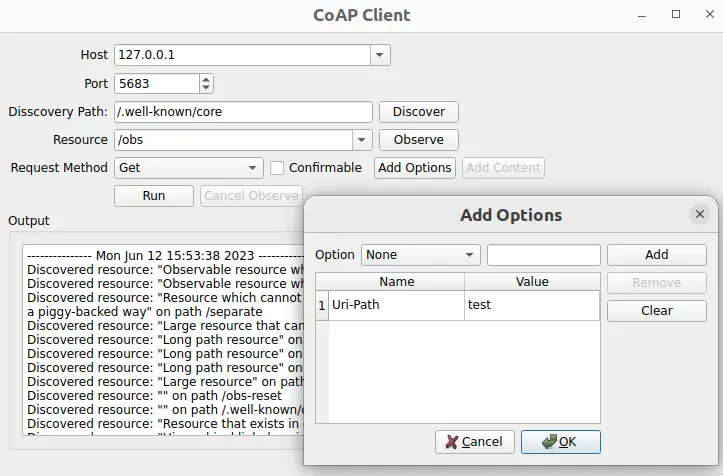

[Qt CoAP Examples](qtcoap-examples.md)> Simple CoAP Client
**Contents**

- [Running the Example](#running-the-example)
- [Setting Up a CoAP Server](#setting-up-a-coap-server)
- [Using the Docker-based Test Server](#using-the-docker-based-test-server)
- [Creating a Client](#creating-a-client)
- [Sending Requests](#sending-requests)

# Simple CoAP Client

Creating an application that communicates with a CoAP server.


_Simple CoAP Client_ demonstrates how to create a minimalistic CoAP client application to send and receive CoAP messages.
#### Running the Example

To run the example from [Qt Creator](https://doc.qt.io/qtcreator/), open the **Welcome** mode and select the example from **Examples**. For more information, see [Qt Creator: Tutorial: Build and run](https://doc.qt.io/qtcreator/creator-build-example-application.html).

#### Setting Up a CoAP Server

To use the application, you need to specify a CoAP server. You have the following options:
- Use the CoAP test server located at `coap://coap.me`.
- Create a CoAP server using [libcoap](https://github.com/obgm/libcoap), [FreeCoAP](https://github.com/keith-cullen/FreeCoAP) or any other CoAP server implementation.
- Use the [Californium](https://github.com/eclipse/californium/) plugtest server, which supports most of the CoAP features. You can build it manually or use a ready Docker image, which builds and starts the plugtest server. The steps for using the docker-based server are described below.


##### Using the Docker-based Test Server

The following command pulls the docker container for the CoAP server from the Docker Hub and starts it:
```cpp
docker run --name coap-test-server -d --rm -p 5683:5683/udp -p 5684:5684/udp tqtc/coap-californium-test-server:3.8.0

```

To find out the IP address of the docker container, first retrieve the container ID by running `docker ps`, which will output something like:
```cpp
$ docker ps
CONTAINER ID        IMAGE
5e46502df88f        tqtc/coap-californium-test-server:3.8.0

```

Then you can obtain the IP address with the following command:
```cpp
docker inspect <container_id> | grep IPAddress

```

For example:
```cpp
$ docker inspect 5e46502df88f | grep IPAddress
...
"IPAddress": "172.17.0.2",
...

```

The CoAP test server will be reachable by the retrieved IP address on ports _5683_ (non-secure) and _5684_ (secure).
To terminate the docker container after usage, use the following command:
```cpp
docker stop <container_id>

```

The `<container_id>` here is the same as retrieved by the `docker ps` command.

#### Creating a Client

The first step is to create a CoAP client using the [QCoapClient](qcoapclient.md) class. Then we need to connect its signals, to get notified when a CoAP reply is received or a request has failed:
```cpp
MainWindow::MainWindow(QWidget *parent) :
    QMainWindow(parent),
    ui(new Ui::MainWindow)
{
    m_client = new QCoapClient(QtCoap::SecurityMode::NoSecurity, this);
    connect(m_client, &QCoapClient::finished, this, &MainWindow::onFinished);
    connect(m_client, &QCoapClient::error, this, &MainWindow::onError);
    ...

```


#### Sending Requests

We use the [QCoapRequest](qcoaprequest.md) class to create CoAP requests. This class provides methods for constructing CoAP frames.
```cpp
void MainWindow::on_runButton_clicked()
{
    const auto msgType = ui->msgTypeCheckBox->isChecked() ? QCoapMessage::Type::Confirmable
                                                          : QCoapMessage::Type::NonConfirmable;
    QUrl url;
    url.setHost(tryToResolveHostName(ui->hostComboBox->currentText()));
    url.setPort(ui->portSpinBox->value());
    url.setPath(ui->resourceComboBox->currentText());

    QCoapRequest request(url, msgType);
    for (const auto &option : std::as_const(m_options))
        request.addOption(option);
    ...

```

In this example, we set the URL, as well as the message type and add options to the request. It is also possible to set the payload, message ID, token, and so on, but we are using the default values here. Note that by default, the message ID and token are generated randomly.
Based on the selected request method, we send a `GET`, `PUT`, `POST` or `DELETE` request to the server:
```cpp
    ...
    switch (method) {
    case QtCoap::Method::Get:
        m_client->get(request);
        break;
    case QtCoap::Method::Put:
        m_client->put(request, m_currentData);
        break;
    case QtCoap::Method::Post:
        m_client->post(request, m_currentData);
        break;
    case QtCoap::Method::Delete:
        m_client->deleteResource(request);
        break;
    default:
        break;
    }
    ...

```

For `PUT` and `POST` requests we also add `m_currentData` as a payload for the request.
For browsing the contents of the server and discovering the resources available on it, a _discovery_ request is used:
```cpp
void MainWindow::on_discoverButton_clicked()
{
    ...
    QCoapResourceDiscoveryReply *discoverReply =
            m_client->discover(url, ui->discoveryPathEdit->text());
    if (discoverReply) {
        connect(discoverReply, &QCoapResourceDiscoveryReply::discovered,
                this, &MainWindow::onDiscovered);
    ...

```

> **Note:** Instead of QCoapReply class, we use the QCoapResourceDiscoveryReply to keep the reply for a discovery request. It has the QCoapResourceDiscoveryReply::discovered signal, which returns the list of QCoapResources that has been discovered.

If there are _observable_ resources on the server (meaning that they have the resource type `obs`), we can subscribe to updates on that resource by running an _observe_ request:
```cpp
void MainWindow::on_observeButton_clicked()
{
    ...
    QCoapReply *observeReply = m_client->observe(url);
    ...
    connect(observeReply, &QCoapReply::notified, this, &MainWindow::onNotified);
    ...

```

The client can unsubscribe from the resource observation by handling the `clicked()` signal of the `cancelObserveButton`:
```cpp
    ...
    connect(ui->cancelObserveButton, &QPushButton::clicked, this, [this, url]() {
        m_client->cancelObserve(url);
        ui->cancelObserveButton->setEnabled(false);
    });

```

The responses coming from the server are displayed in the UI:
```cpp
void MainWindow::addMessage(const QString &message, bool isError)
{
    const QString content = "--------------- %1 ---------------\n%2\n\n"_L1
                                .arg(QDateTime::currentDateTime().toString(), message);
    ui->textEdit->setTextColor(isError ? Qt::red : Qt::black);
    ui->textEdit->insertPlainText(content);
    ui->textEdit->ensureCursorVisible();
}

void MainWindow::onFinished(QCoapReply *reply)
{
    if (reply->errorReceived() == QtCoap::Error::Ok)
        addMessage(reply->message().payload());
}

static QString errorMessage(QtCoap::Error errorCode)
{
    const auto error = QMetaEnum::fromType<QtCoap::Error>().valueToKey(static_cast<int>(errorCode));
    return MainWindow::tr("Request failed with error: %1\n").arg(error);
}

void MainWindow::onError(QCoapReply *reply, QtCoap::Error error)
{
    const auto errorCode = reply ? reply->errorReceived() : error;
    addMessage(errorMessage(errorCode), true);
}

void MainWindow::onDiscovered(QCoapResourceDiscoveryReply *reply, QList<QCoapResource> resources)
{
    if (reply->errorReceived() != QtCoap::Error::Ok)
        return;

    QString message;
    for (const auto &resource : std::as_const(resources)) {
        ui->resourceComboBox->addItem(resource.path());
        message += tr("Discovered resource: \"%1\" on path %2\n")
                        .arg(resource.title(), resource.path());
    }
    addMessage(message);
}

void MainWindow::onNotified(QCoapReply *reply, const QCoapMessage &message)
{
    if (reply->errorReceived() == QtCoap::Error::Ok) {
        addMessage(tr("Received observe notification with payload: %1")
                        .arg(QString::fromUtf8(message.payload())));
    }
}

static QString tryToResolveHostName(const QString hostName)
{
    const auto hostInfo = QHostInfo::fromName(hostName);
    if (!hostInfo.addresses().empty())
        return hostInfo.addresses().first().toString();

    return hostName;
}


```


---

*Built with QDoc's template engine.*
